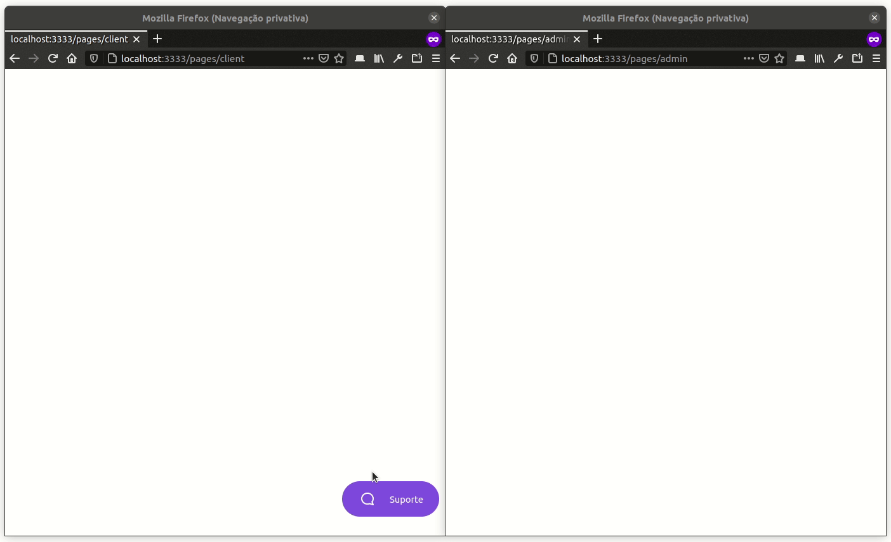

#	🚀	My-NLW5

<div align="left">
    
    
    
    
    
</div>

---

Project using Node.js developed along the **Next Level Week 05** from **[Rocketseat](https://rocketseat.com.br/)**. This project implements a live chat using NodeJS to build the backend of this service. 

<p align="center">
  
</p>

---

##	🔧	Technologies Used

Throughout the development of this chat, it was possible to consolidate important concepts such as: generation of random IDs; connection and use of SQL database through an Object Relational Mapper library; emit and listen to websocket events; create and use HTTP routes and methods; use typescript to avoid data type problems and to optimize the development process; connect the backend with the frontend; and how to use tools like Insomnia and Beekeeper Studio to test the developed system.

- **[NodeJS](https://nodejs.org/en/)**
- **[TypeScript](https://www.typescriptlang.org/)**
- **[TypeORM](https://typeorm.io/#/)**
- **[Javascript](https://developer.mozilla.org/pt-BR/docs/Web/JavaScript)**
- **[SQLite Database](https://www.sqlite.org/index.html)**
- **[HTTP Protocol](https://developer.mozilla.org/pt-BR/docs/Web/HTTP)**
- **[Websocket Protocol](https://socket.io/)**
- **[HTML](https://developer.mozilla.org/pt-BR/docs/Web/HTML)**
- **[CSS](https://developer.mozilla.org/pt-BR/docs/Web/CSS)**
- **[Insomnia](https://insomnia.rest/download)**
- **[Beekeeper Studio](https://www.beekeeperstudio.io/)**

---

##	📦	Install

To test this project, make a clone of this repository and then install it using:

```bash
$ git clone https://github.com/NanderSantos/My-NLW5.git

$ cd My-NLW5

$ yarn install

$ yarn init-db
```

Or just run this one-liner command and everything will be done:

```bash
$ git clone https://github.com/NanderSantos/My-NLW5.git && cd My-NLW5 && yarn install && yarn init-db
```

---

##	🏃	Run

To run this project simply do:

```bash
$ yarn start
```

---

## 🎨 Frontend

To create the frontend (which was outside the scope of this project) two routes were created to statically load the HTML pages present in the **public** directory of this project:

- **/pages/admin ➜** Client interface for the chat

- **/pages/client ➜** Admin interface for the chat

---

##	📨	API

- **POST /settings ➜** Creates a setting profile using a JSON passed in the request body with this fields, where: **chat** controls the visibility of the chat en the client page and the **username** identifys a user:

```json
Send:

{
	"chat": true,
	"username": "admin"	
}

Return:

{
	"id": "3ffc03a4-46b1-427e-adbf-ad2eb50315a0",
	"username": "admin",
	"chat": true,
	"updated_at": "2021-04-22T16:23:10.000Z",
	"created_at": "2021-04-22T16:23:10.000Z"
}
```

- **GET /settings/:username ➜** Returns the settings of the user passed as route param in **:username**:

```json
Return:

{
	"id": "3ffc03a4-46b1-427e-adbf-ad2eb50315a0",
	"username": "admin",
	"chat": true,
	"updated_at": "2021-04-24T22:53:27.000Z",
	"created_at": "2021-04-22T16:23:10.000Z"
}
```

- **PUT /settings/:username ➜** Updates the chat visibility setting for the client passed as route param in **:username** using a JSON in the request body with a single field **chat** corresponding to the chat visibility:

```json
{
	"chat": true
}
```

- **POST /users ➜** Creates a user using a JSON passed in the request body with this single field **email**, corresponding to the user email:

```json
Send:

{
	"email": "user@gmail.com"
}

Return:

{
	"id": "3cae107d-4906-4fb9-ae65-77535388eacc",
	"email": "user@gmail.com",
	"created_at": "2021-04-21T14:25:55.000Z"
}
```

- **POST /messages ➜** Sends a message using a JSON passed in the request body with this fields, where: **user_id** corresponds to the ID of the user that you want to list the messages, **text** corresponds to the message sent and **admin_id** corresponds to the administrator ID:

```json
Send:

{
	"user_id": "3cae107d-4906-4fb9-ae65-77535388eacc",
	"text": "Hello, world!",
	"admin_id": "1b629924-a3b2-465c-be8a-edbc550af6db"
}

Return:

{
	"id": "0cb8687f-8865-4da6-a44b-067c779b05dd",
	"admin_id": "1b629924-a3b2-465c-be8a-edbc550af6db",
	"text": "Hello, world!",
	"user_id": "3cae107d-4906-4fb9-ae65-77535388eacc",
	"created_at": "2021-04-21T15:18:37.000Z"
}
```

- **POST /messages/:id ➜** Returns a message list for the user passed as route param **:id**

```json
Return:

[
  {
    "id": "76d69afa-339e-45ce-96cc-97b7339c6e85",
    "admin_id": null,
    "text": "Hi, I need help!",
    "user_id": "df236b69-d24d-4030-aff1-5f036d2ee5e6",
    "created_at": "2021-04-24T15:02:55.000Z",
    "user": {
      "id": "df236b69-d24d-4030-aff1-5f036d2ee5e6",
      "email": "user@gmail.com",
      "created_at": "2021-04-24T15:02:55.000Z"
    }
  },
  {
    "id": "a528a1bd-e78f-4e69-b4a6-3703394bc610",
    "admin_id": "0KU_ehwjLC8uUa1hAAAR",
    "text": "Hi!",
    "user_id": "df236b69-d24d-4030-aff1-5f036d2ee5e6",
    "created_at": "2021-04-24T15:03:01.000Z",
    "user": {
      "id": "df236b69-d24d-4030-aff1-5f036d2ee5e6",
      "email": "user@gmail.com",
      "created_at": "2021-04-24T15:02:55.000Z"
    }
  },
]
```
